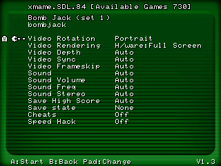
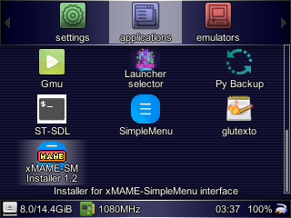
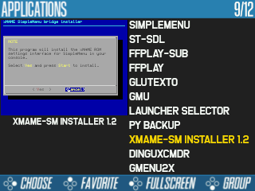
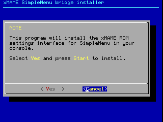

# RG350 xMAME SimpleMenu bridge

[xMAME](https://apuntes.eduardofilo.es/2020-04-15-rg350_xmame.html) has its own frontend that inserts a settings screen between the selection of the ROM and its final execution. This one:

When xMAME is integrated into SimpleMenu this settings screen is lost and the ROM is executed with the default options. To improve this situation, a kind of clone of the xMAME settings screen has been developed that can be integrated between SimpleMenu and the xMAME binaries that run the ROM at the end.

It works on both screen models of RG350, i.e. it works for both the original model and the new RG350P and RG350M.

## Installation

The installation is done through an OPK that places the necessary files within the path where xMAME is located (specifically in the `/media/data/local/share/xmame/sm_bridge` subdirectory). It also makes automatically the modifications in the SimpleMenu configuration files. Naturally, first we will have to install [xMAME](https://apuntes.eduardofilo.es/2020-04-15-rg350_xmame.html) and [SimpleMenu](https://apuntes.eduardofilo.es/2020-01-25-rg350_simplemenu.html).

The OPK with the installer can be obtained in the releases of this repository.

Once installed on the RG350, we must find it in our launcher in the applications section. e.g.:

Once installed we will open it and follow the instructions on the screen:

## Use

From now on, when executing a ROM with the xMAME system integrated in SimpleMenu, a small interface will appear very similar to the one shown by the xMAME interface just after selecting the ROM.

<iframe width="640" height="480" src="https://www.youtube.com/embed/1OH2ENqr1tA" frameborder="0" allow="accelerometer; autoplay; clipboard-write; encrypted-media; gyroscope; picture-in-picture" allowfullscreen></iframe>

The controls of the xMAME settings screen have been replicated and, as in it, are indicated in the legend below. They are basically these:

* **Up/Down**: To select the setting to be modified.
* **Left/Right**: To change the value of the selected setting.
* **A**: To confirm the game start.
* **B**: To cancel the start of the game, i.e. to return to SimpleMenu.

When starting the game (not so if we go back with `B`) the settings are saved in the same file that xMAME uses. Therefore, the adjustments we make will persist between different sessions. They will also be compatible with the settings we have made in xMAME.

As mentioned, the same settings are shown as in xMAME, but there are two exceptions:

* In the **Video Rotation** setting there is an additional possible value. In xMAME the possible values were: `Auto`,` Landscape` and `Portrait`. In this new interface, the `Portrait` value has been split into two: `Portrait (L)` and `Portrait (R)`. This is because internally xMAME supports two horizontal display options (rotated to the left and to the right). For some reason only one of them is offered in the original xMAME interface. Here both are shown. There is a problem however, and it is that the configuration file where the settings for each game are stored does not support this additional `Portrait (R)` mode, so if it is used, when we try to launch the game again we will find the value closest to the selected `Portrait (L)`.
* The **Save state** setting does not work even in xMAME (the emulator is closed when changing the default value `None`), so in this reimplementation of the settings screen we have chosen to disable it. For this reason it appears in gray.
